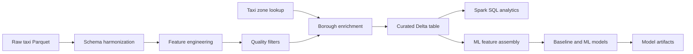

# NYC Taxi Databricks Analytics

<p align="center">
  
  
  
  
  
</p>

<p align="center">
  
</p>

**Databricks lakehouse project** for NYC green and yellow taxi trip data. The
workflow ingests **raw Parquet files**, builds **curated Delta tables**,
produces **borough-level operational analytics**, and trains **Spark-based fare
prediction models** from engineered trip features.

The repository is organized for technical review: the notebook is the
**executable source**, the HTML report captures the **Databricks run output**,
and the documentation explains the **engineering and modeling decisions**.

## 1. Project Highlights

- Processed **nearly 1 billion raw taxi trips** in Databricks using PySpark and
  Delta Lake.
- Standardized **green and yellow taxi schemas** into a shared analytical
  model.
- Applied explicit data quality rules and retained **974.7M clean trips** from
  the v3 Databricks run, removing **1.69%** of raw rows.
- Enriched trips with NYC taxi zone and borough metadata from 265 locations.
- Analyzed demand, revenue, tips, speed, duration, distance efficiency, and
  borough-to-borough route behavior.
- Compared a hierarchical route-time baseline against ridge regression,
  gradient-descent ridge, Huber regression, and fallback tree-style scoring.
- Selected **closed-form ridge regression** as the best validation model,
  improving validation RMSE from **17.461** to **13.356**.

## 2. Technical Skills

- **Cloud analytics:** Databricks Workspace, Unity Catalog, Volumes, managed
  Delta tables.
- **Distributed data engineering:** PySpark DataFrames, Spark SQL, schema
  harmonization, large-scale joins, aggregation, and persistence.
- **Lakehouse design:** raw volume paths, curated tables, reusable artifact
  paths, and governed table naming.
- **Data quality:** timestamp bounds, distance/duration/fare filters, row
  retention measurement, and borough enrichment checks.
- **Analytics engineering:** route-level SQL metrics, monthly summaries,
  revenue share analysis, tip behavior, and operational speed/distance KPIs.
- **Machine learning:** time-based splitting, target encoding, feature
  standardization, baseline modeling, closed-form ridge regression, gradient
  descent, Huber loss, and model artifact persistence.
- **Project communication:** exported HTML report, handover PDF, setup notes,
  and notebook summary documentation.

## 3. Results Snapshot

| Area | Result |
| --- | --- |
| Raw rows | **991,467,464** |
| Clean rows | **974,672,551** |
| Rows removed | **16,794,913**, or **1.69%** |
| Taxi zones loaded | 265 |
| Tip participation | **62.94%** of trips |
| High-tip share | **0.83%** of tipped trips had tips of at least $15 |
| Top 2024 revenue route | **Manhattan to Manhattan** |
| Best validation model | **Closed-form ridge regression** |
| Best validation RMSE | **13.356** |
| Test RMSE for selected model | **102.847** |

## 4. Repository Structure

```text
.
|-- README.md
|-- docs/
|   |-- 0_coding_standards.md
|   |-- 1_project_brief.md
|   |-- 2_databricks_setup.md
|   |-- 3_notebook_summary.md
|   |-- 4_project_handover.md
|   |-- 5_architecture.md
|   |-- 6_data_quality.md
|   `-- 7_model_results.md
|-- notebooks/
|   `-- nyc_taxi_databricks_analytics.ipynb
|-- reports/
|   |-- nyc_taxi_databricks_analytics.html
|   `-- nyc_taxi_databricks_handover_report.pdf
`-- src/
    |-- feature_engineering/
    |-- ingestion/
    |-- modeling/
    `-- transformation/
```

The project is notebook-first. The `src/` folders document the intended module
boundaries if the notebook is later converted into scheduled Databricks jobs.

## 5. Key Artifacts

- [notebooks/nyc_taxi_databricks_analytics.ipynb](notebooks/nyc_taxi_databricks_analytics.ipynb) -
  executable Databricks notebook.
- [reports/nyc_taxi_databricks_analytics.html](reports/nyc_taxi_databricks_analytics.html) -
  exported analysis report for reviewers.
- [reports/nyc_taxi_databricks_handover_report.pdf](reports/nyc_taxi_databricks_handover_report.pdf) -
  formal handover report.
- [docs/0_coding_standards.md](docs/0_coding_standards.md) - notebook,
  runtime, documentation, and git hygiene standards.
- [docs/1_project_brief.md](docs/1_project_brief.md) - project goals and
  core analytical tasks.
- [docs/2_databricks_setup.md](docs/2_databricks_setup.md) - Databricks runtime,
  storage, and execution guidance.
- [docs/3_notebook_summary.md](docs/3_notebook_summary.md) - technical workflow
  summary.
- [docs/4_project_handover.md](docs/4_project_handover.md) - editable
  handover source with v3 run evidence.
- [docs/5_architecture.md](docs/5_architecture.md) - end-to-end lakehouse
  flow and productionization path.
- [docs/6_data_quality.md](docs/6_data_quality.md) - cleaning rules, row
  retention evidence, and modeling implications.
- [docs/7_model_results.md](docs/7_model_results.md) - model comparison,
  selection rationale, and next modeling improvements.

## 6. How to Run

1. Clone this repository into a Databricks Git folder.
2. Open `notebooks/nyc_taxi_databricks_analytics.ipynb`.
3. Attach a cluster with Spark, Python, Delta Lake, and Unity Catalog support.
4. Confirm the configuration section near the top of the notebook:

   ```python
   CATALOG = "workspace"
   SCHEMA = "bde"
   VOLUME = "nyc_taxi"
   RUN_DOWNLOADS = True
   ALLOW_RUNTIME_PIP_INSTALL = True
   OVERWRITE_TABLES = True
   RUN_PROFILE_PREVIEWS = False
   RUN_MODEL_DIAGNOSTICS = False
   ```

5. Upload `taxi_zone_lookup.csv` to:

   ```text
   /Volumes/<catalog>/<schema>/<volume>/taxi_zone_lookup.csv
   ```

6. Run all notebook cells from top to bottom.
7. Export a refreshed HTML report after logic or output changes.

The notebook writes these main outputs:

```text
<catalog>.<schema>.taxi_zone_lookup
<catalog>.<schema>.taxi_trips_cleaned_borough
/Volumes/<catalog>/<schema>/<volume>/models/model_a_ridge_v1
```

## 7. Technical Decisions

- **Visible data quality controls:** the v3 run removed 16.8M rows, or 1.69%
  of the raw dataset, while preserving a large clean analytical base.
- **Borough-level enrichment:** zone metadata turns trip-level records into
  interpretable pickup/dropoff flows for route, revenue, and operations
  analysis.
- **Train-only modeling assets:** target encoders, standardization statistics,
  robust label caps, and baseline maps are fitted from training data only.
- **Focused default execution:** raw previews and model diagnostics are opt-in
  so the main Databricks run stays centered on required evidence.
- **Efficient diagnostics:** VIF-style checks are documented from earlier
  diagnostics but kept outside the default run because they add cost without
  changing the selected model.
- **Model choice:** closed-form ridge regression provides the best validation
  RMSE with lower complexity than iterative alternatives.

## 8. Architecture



The full architecture notes are in
[docs/5_architecture.md](docs/5_architecture.md).

## 9. Roadmap

- Add MLflow tracking for model parameters, metrics, and persisted artifacts.
- Convert the notebook into a Databricks Workflow with explicit task boundaries
  for ingestion, transformation, analytics, and modeling.
- Add schema drift checks, source file manifests, and automated data quality
  assertions for repeatable production runs.
- Move stable notebook utilities into tested `src` modules once the workflow is
  scheduled as reusable pipeline code.
- Add segment-level error analysis by taxi color, borough pair, and duration
  bin.
