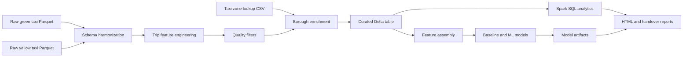

# Architecture

This document describes the end-to-end architecture for the NYC Taxi
Databricks Analytics project as a personal lakehouse portfolio project.

## 1. System Flow

## 2. Lakehouse Layers

| Layer | Purpose | Main Objects |
| --- | --- | --- |
| Raw volume | Store downloaded taxi source files | Green and yellow Parquet files |
| Reference table | Store zone metadata | `taxi_zone_lookup` |
| Curated table | Store cleaned borough-enriched trips | `taxi_trips_cleaned_borough` |
| Analytics outputs | Answer route, demand, fare, and tip questions | Spark SQL result tables |
| Model artifacts | Persist selected model assets | Weights, encoders, z-score stats, metadata |

## 3. Design Choices

- **Notebook-first execution:** keeps the full workflow transparent and easy to
  review while the project is still exploratory.
- **Unity Catalog paths:** make source files, tables, and model artifacts
  discoverable across Databricks sessions.
- **Delta persistence:** provides durable curated tables for analytics and
  repeatable modeling.
- **Train-only modeling assets:** avoid validation leakage by fitting target
  encoders, standardization values, robust caps, and baseline maps on training
  data only.
- **Opt-in diagnostics:** keep expensive profile and model diagnostics outside
  the default path while preserving the ability to inspect them when needed.

## 4. Productionization Path

The next architecture step is to convert the notebook into a Databricks
Workflow with separate tasks:

1. Source ingestion and reference validation.
2. Schema harmonization and quality filtering.
3. Curated table build and retention audit.
4. Analytics query execution.
5. Model training, evaluation, and artifact persistence.

This task split would make retries cheaper, isolate failures, and support
scheduled refreshes without losing the readable notebook version.
